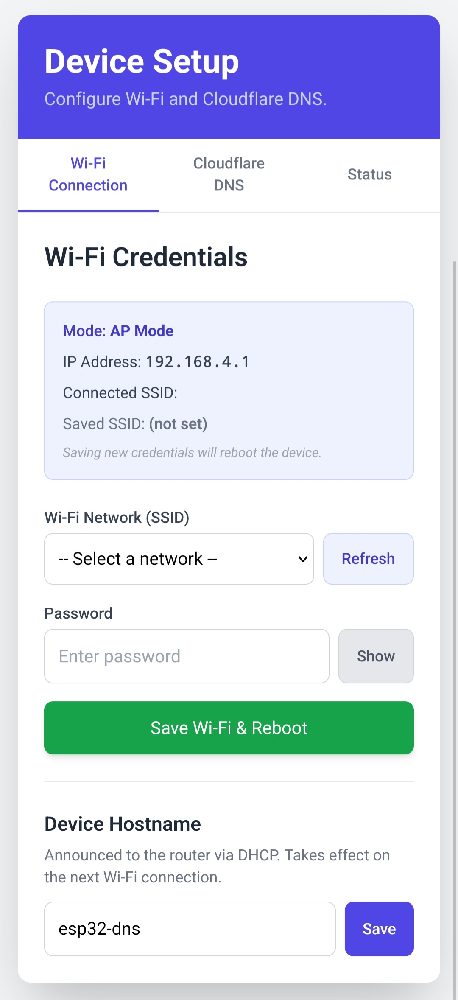
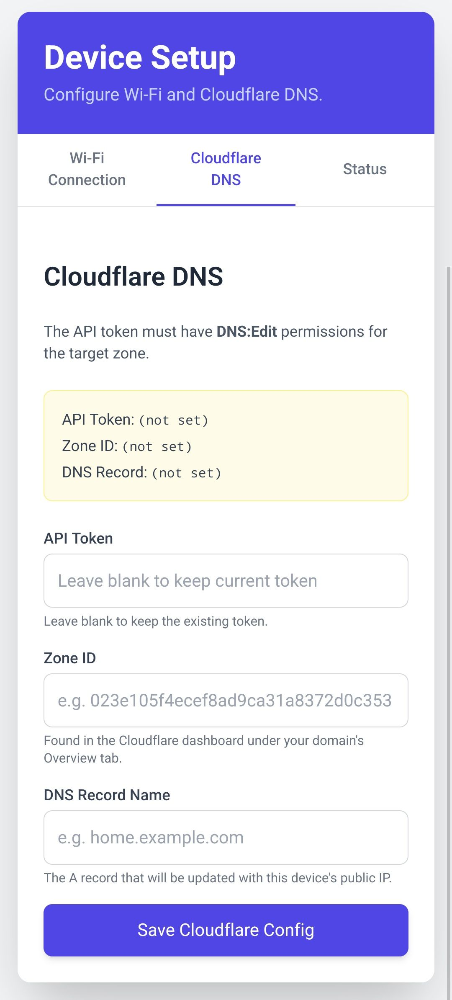
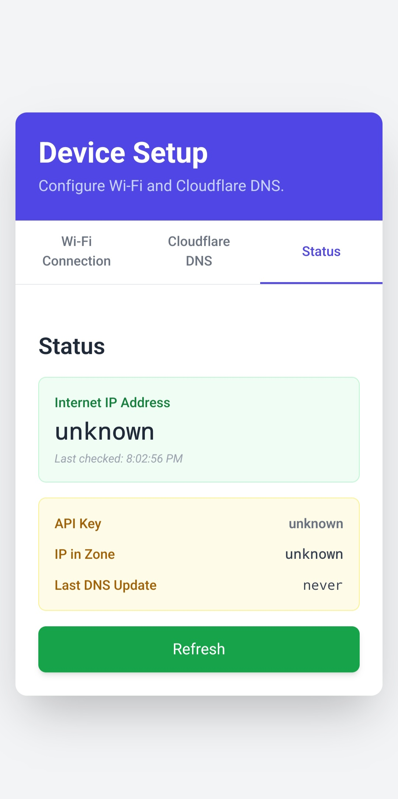

> [!NOTE]
> This App has been partially Vibed Coded. .
> I made this app for my personal use, but I am sharing it because it works perfectly for my use case, and maybe its useful for others.
> If you have an issue with the app being Vibe Coded, please refrain to make any comments. Thanks.

## Prerequisites

- `uv`
- A Microcontroller with [Micropython](https://micropython.org/) installed

## Initialization

### Project Dependencies

To initialize the project

`uv sync`

then activate with:

`source .venv/bin/activate`

### MicroPython Stubs (Optional)

With the environment activated, install the Stubs with

`pip install -U micropython-esp32-stubs==1.26.0.post1 --target typings --no-user`

Create a `.vscode` folder with a `settings.json` files:

```json
{
    "python.languageServer": "Pylance",
    "python.analysis.typeCheckingMode": "basic",
    "python.analysis.diagnosticSeverityOverrides": {
    "reportMissingModuleSource": "none"
    },
    "python.analysis.typeshedPaths": [
        "typings"
    ],
} 
```

## Installation on ESP32

Using mpremote, copy the files inside the src folder. The following code should work.

```bash
cd src
mpremote fs cp -r . :/
```

## Usage

After uploading the project files to the ESP-32, do a Soft Reset and connect to the microcontroller AP. The AP SSID is `ESP32-DNSConfig`.

Once connected, go to `192.168.4.1` and the Project Main Page should load. If its not loading, check that you are connecting with `http` and not `https`. If you are still having trouble connecting, you can add the port `80` explicitly in the URL: `192.168.4.1:80`.

Once inside, you can configure the Wifi, Cloudflare credentials and check the status of the program.

<p float="left">
  
   
  
</p>


## Manually Uploading config.json

If you want to skip the Graphical Interface configuration, it is possible to upload a `config.json` file manually to the root:

```json
{
  "wifi": {
    "ssid": "<your_ssid>",
    "password": "<your_password>",
    "hostname": "<optional: override the Hostname"
  },
  "cloudflare": {
    "api_key": "<api_key>",
    "record_name": "<record_name>",
    "zone_id": "<zone_id>"
  }
}
```

```bash
mpremote fs cp config.json :/
```