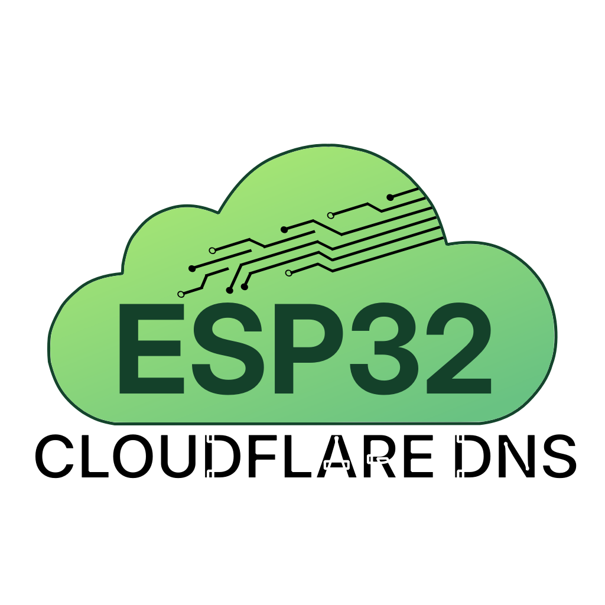

# ESP32-DNS-Cloudflare



> [!NOTE]
> This App has been partially Vibed Coded. .
> I made this app for my personal use, but I am sharing it because it works perfectly for my use case, and maybe its useful for others.
> If you have an issue with the app being Vibe Coded, please refrain to make any comments. Thanks.

## Prerequisites

- `uv`
- A Microcontroller with [Micropython](https://micropython.org/) installed

## Initialization

### Project Dependencies

To initialize the project

`uv sync`

then activate with:

`source .venv/bin/activate`

### MicroPython Stubs (Optional)

With the environment activated, install the Stubs with

`pip install -U micropython-esp32-stubs==1.26.0.post1 --target typings --no-user`

Create a `.vscode` folder with a `settings.json` files:

```json
{
    "python.languageServer": "Pylance",
    "python.analysis.typeCheckingMode": "basic",
    "python.analysis.diagnosticSeverityOverrides": {
    "reportMissingModuleSource": "none"
    },
    "python.analysis.typeshedPaths": [
        "typings"
    ],
} 
```

## Installation on ESP32

Using mpremote, copy the files inside the src folder. The following code should work.

```bash
cd src
mpremote fs cp -r . :/
```

## Usage

After uploading the project files to the ESP-32, do a Soft Reset and connect to the microcontroller AP. The AP SSID is `ESP32-DNSConfig`.

Once connected, go to `192.168.4.1` and the Project Main Page should load. If its not loading, check that you are connecting with `http` and not `https`. If you are still having trouble connecting, you can add the port `80` explicitly in the URL: `192.168.4.1:80`.

Once inside, you can configure the Wifi, Cloudflare credentials and check the status of the program.

<p float="left">
  
   
  
</p>

In the Wifi Credentials tab, the ESP32 automatically scans for available SSIDs, if you want to connect to a hidden SSID, choose `other`. You can also configure your preferred Hostname.

For the Cloudflare DNS tab you will need an API Token, with `edit:zone` permissions, the Zone ID of the Record you want to modify, and the DNS record, like `record.example.com`. Note that it has to be an A record.

In the status tab, you can check the current IP address, if the API Key is valid, what IP is in the Zone and the Last DNS Update. You can force a refresh clicking the Refresh button.

## Leds

The project is configured so that if a led present in `PIN 2` shows the current status of the board. The following table lists the possible led states.

| State | LED behaviour | Trigger |
|---|---|---|
| `ap` | Slow breathing | No saved Wi-Fi credentials, or STA connect failed — device started AP mode |
| `connecting` | 2 Hz blink (infinite) | `wifi.connect_sta()` called, waiting for association |
| `connected` | Solid on for 3 s, then off | STA successfully associated and got an IP |
| `ip_check` | 1 blink | Periodic or forced public IP check (`force_check()`), client mode only |
| `dns_update` | 3 blinks | Cloudflare A/CNAME record successfully updated with new IP |
| `off` | Off | Idle — after `connected` timer expires, or initial state |

Note that if the device fails to connect to the Wifi, it will fallback to AP Mode so that is reconfigured. If the wifi is available again, a simple reset should be enough to revert back to Wifi Client Mode.

## Manually Uploading config.json

If you want to skip the Graphical Interface configuration, it is possible to upload a `config.json` file manually to the root:

```json
{
  "wifi": {
    "ssid": "<your_ssid>",
    "password": "<your_password>",
    "hostname": "<optional: override the hostname>"
  },
  "cloudflare": {
    "api_key": "<api_key>",
    "record_name": "<record_name>",
    "zone_id": "<zone_id>"
  },
  "led_pin": 2
}
```

```bash
mpremote fs cp config.json :/
```

> [!NOTE]
>`led_pin` is optional and can only be set manually. It is not exposed in the web interface. Omit it to use the default GPIO 2.

## Troubleshooting

If you encounter any problems during the configuration, you can connect via serial port, to get debug data and diagnose your problem.
